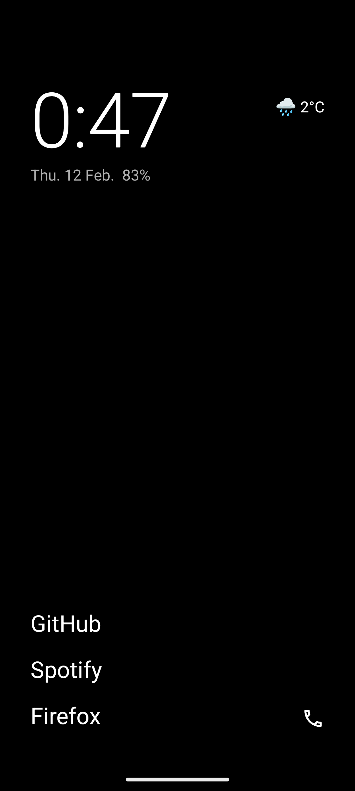
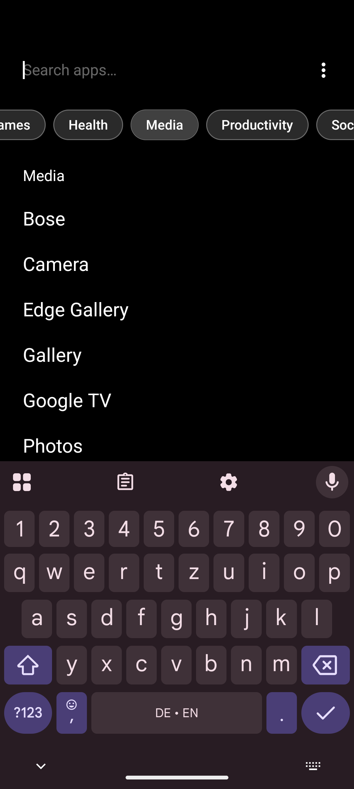
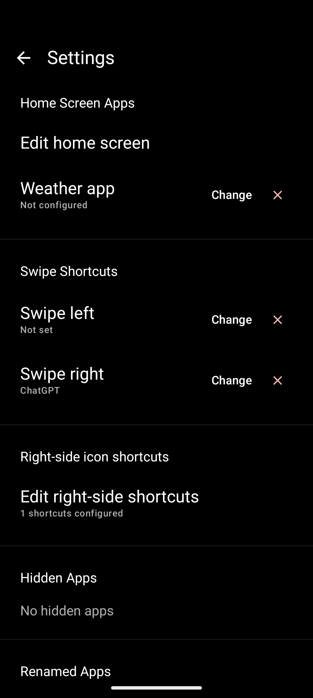

# Fokus Launcher

[](https://www.gnu.org/licenses/gpl-3.0)

Fokus Launcher is an Android launcher for people who want a simpler, cleaner
default experience. It focuses on fast access to time, weather, and core apps,
with minimal visual noise.

## Screenshots

| Home | App Drawer (Search) | Settings |
| --- | --- | --- |
|  |  |  |

## Current Feature Set

Fokus keeps the home screen intentionally minimal: large clock and date, battery
status, optional weather, configurable favorite app labels, and a configurable
right-side shortcut rail. The primary interactions are gesture-based, with swipe
up to open the drawer, swipe down to open the notification/status shade, and
left/right swipes to launch shortcut targets.

The app drawer is optimized for quick launch. Search and categories can narrow
results fast, and when only one app matches a query, Fokus can launch it
directly. Long-pressing a drawer app opens actions like add to home, rename,
hide, and uninstall.

Customization and organization are built in. You can edit home apps, edit
right-side shortcuts (including launcher shortcut actions, not just app opens),
hide or rename apps, and manage launcher data from settings. Weather uses
Open-Meteo with no API key and caches results for 30 minutes. On Android 15+
(API 35+), Fokus also supports Private Space with lock/unlock controls and a
separate drawer section for private apps when unlocked.

## First-Run Experience

On first launch, Fokus walks through onboarding with welcome, optional location
permission for weather, default-launcher setup (only when needed), home-screen
customization, swipe-shortcut setup, and quick gesture tips.

## Build From Source

Fokus Launcher targets Android 8.0+ (API 26). It currently builds with compile
SDK / target SDK `36`, Gradle `9.1.0`, AGP `9.0.0`, and JDK toolchain `21` (the
project code is compiled with Java 11 compatibility).

### Development Environment

- JDK 21 installed and available via `JAVA_HOME`
- Android SDK with platform-tools, `platforms;android-36`, and `build-tools;36.0.0`
- Gradle wrapper (included in this repository)

Android Studio is optional. The Gradle commands below are sufficient for builds
and tests; use Android Studio only if you want the emulator, layout inspector,
or Compose previews.

```bash
./gradlew assembleDebug
```

To install directly on a connected device:

```bash
./gradlew installDebug
```

To run unit tests:

```bash
./gradlew testDebugUnitTest
```

The debug APK is generated at `app/build/outputs/apk/debug/`.

## Project Stack

The app is written in Kotlin with Jetpack Compose and Material 3 for UI, Hilt
for dependency injection, Room for local structured data, DataStore for
preferences, and Navigation Compose for screen flow.

## Permissions

Fokus asks only for what it uses: app discovery, uninstall intents, weather
fetches, optional local weather location, hidden-profile access for Private
Space support, and status-bar expansion interactions.

| Permission                | Purpose                                       |
| ------------------------- | --------------------------------------------- |
| `QUERY_ALL_PACKAGES`      | Enumerate installed apps for launcher UI      |
| `REQUEST_DELETE_PACKAGES` | Trigger uninstall flow from launcher actions  |
| `INTERNET`                | Fetch weather data                            |
| `ACCESS_COARSE_LOCATION`  | Show location-based weather                   |
| `ACCESS_HIDDEN_PROFILES`  | Support Android Private Space profile access  |
| `EXPAND_STATUS_BAR`       | Expand notifications/status bar from launcher |

## Contributing

If you want to improve Fokus, open an issue or send a pull request with a clear
problem statement and reproduction details when relevant. Focused changes,
thoughtful UX decisions, and good test coverage are always appreciated.

## License

Fokus Launcher is licensed under the GNU General Public License v3.0. See
[LICENSE](LICENSE).
