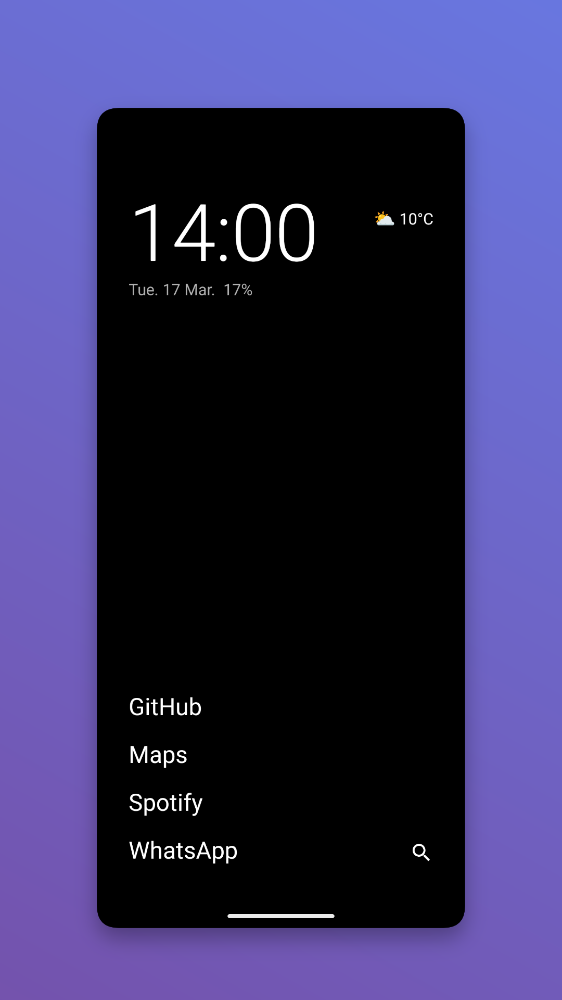
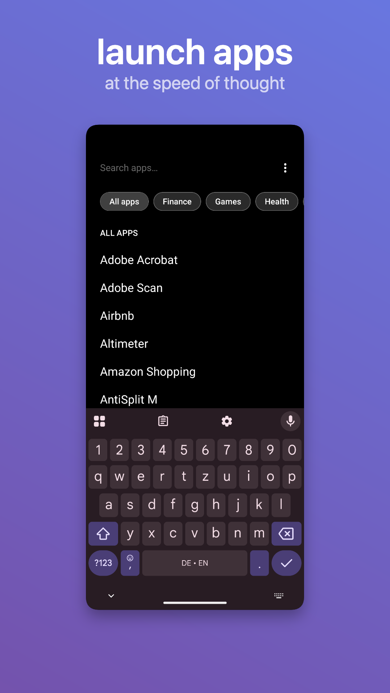
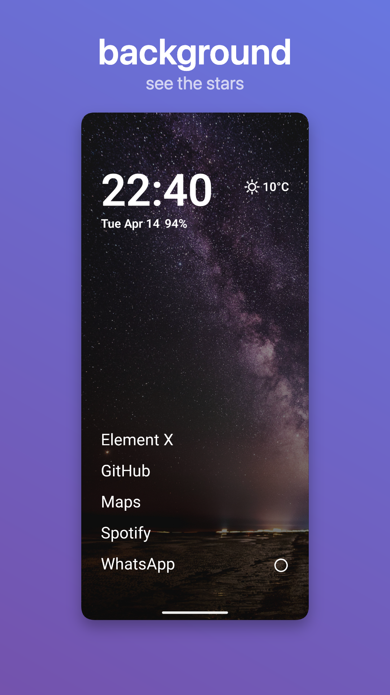
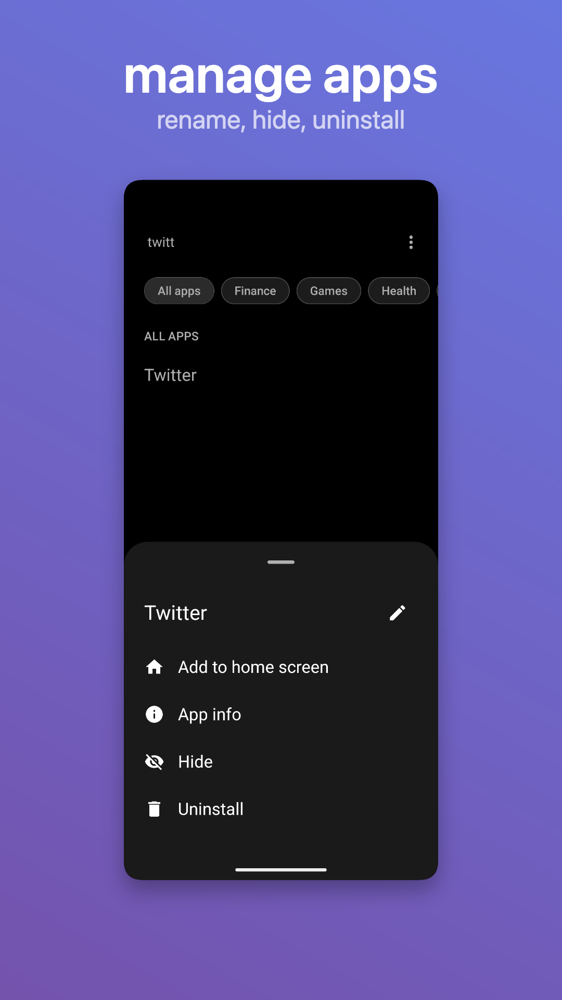
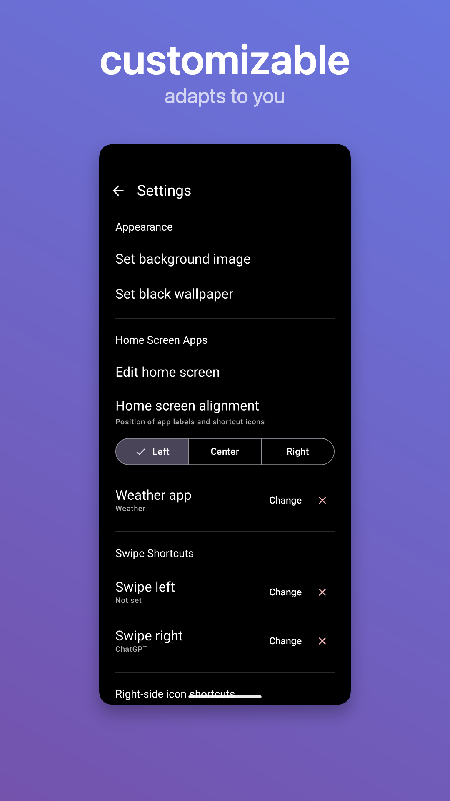

# Fokus Launcher

[](https://www.gnu.org/licenses/gpl-3.0)
<a href="https://hosted.weblate.org/engage/fokus-launcher/">

</a>

Fokus Launcher is an Android launcher for people who want a simpler, cleaner
default experience. It focuses on fast access to time, weather, and core apps,
with minimal visual noise.

[](https://f-droid.org/packages/io.github.luantak.fokuslauncher/)

## Screenshots

<p align="center">
  <a href="fastlane/metadata/android/en-US/images/phoneScreenshots/screenshot-1.png">
    
  </a>
  <a href="fastlane/metadata/android/en-US/images/phoneScreenshots/screenshot-2.png">
    
  </a>
</p>

<p align="center">
  <a href="fastlane/metadata/android/en-US/images/phoneScreenshots/screenshot-3.png">
    
  </a>
  <a href="fastlane/metadata/android/en-US/images/phoneScreenshots/screenshot-4.png">
    
  </a>
</p>

<p align="center">
  <a href="fastlane/metadata/android/en-US/images/phoneScreenshots/screenshot-5.png">
    
  </a>
</p>

## Current Feature Set

### Home screen and gestures

The home screen stays minimal: large clock and date, battery status, weather,
favorite app labels, and a right-side shortcut rail. Tapping the clock, date, or
weather opens the apps you configure for those widgets in settings. Swipe up for
the drawer, swipe down for the notification shade, swipe left/right for shortcut
targets.

### App drawer

Search and categories narrow the list quickly, and you can define and assign
categories in settings. A single matching app can launch on search. **Category
sidebar** (Settings → **Show category sidebar**) swaps the bar for a vertical
category rail. Use the search icon for text search, pick left or right
placement, long-press a category to change its icon. **Dot search** sends the
search field to the web or an app: `. query` for the default target,
`.<letter> query` for a shortcut (for example `.a coffee`). Configure targets
under Settings → Dot search (search-capable apps or URL templates with a query
placeholder). Long-press an app for add to home, rename, hide, or uninstall.

### Customization and profiles

Edit home apps and shortcuts (including launcher shortcut actions), hide or
rename apps, and manage launcher data from settings. Choose a custom font.
Weather uses Open-Meteo (no API key) with a 30-minute cache. On Android 15+ (API
35+), Private Space adds lock/unlock and a separate private-apps section in the
drawer. Work profile apps appear with personal apps when a work profile is
active.

### Device controls (optional)

These features need Android's accessibility service.

**Double tap to lock** locks the screen from a double-tap on empty home space.
**Return home after long lock** notices when the device stayed locked with the
screen off longer than a threshold you set (default 15 minutes) and brings Fokus
to the foreground on unlock so you start on the home screen. That second option
also needs battery optimization disabled for reliable timing.

## First-Run Experience

On first launch, Fokus walks through onboarding with welcome, optional location
permission for weather, default-launcher setup (only when needed), home-screen
customization, swipe-shortcut setup, and quick gesture tips.

## Build From Source

Fokus Launcher targets Android 8.0+ (API 26). It currently builds with compile
SDK / target SDK `36`, Gradle `9.1.0`, AGP `9.0.0`, and JDK toolchain `21` (the
project code is compiled with Java 11 compatibility).

### Development Environment

- JDK 21 installed and available via `JAVA_HOME`
- Android SDK with platform-tools, `platforms;android-36`, and
  `build-tools;36.0.0`
- Gradle wrapper (included in this repository)

Android Studio is optional. The Gradle commands below are sufficient for builds
and tests; use Android Studio only if you want the emulator, layout inspector,
or Compose previews.

```bash
./gradlew assembleDebug
```

To install directly on a connected device:

```bash
./gradlew installDebug
```

To run unit tests:

```bash
./gradlew testDebugUnitTest
```

The debug APK is generated at `app/build/outputs/apk/debug/`.

## Project Stack

The app is written in Kotlin with Jetpack Compose and Material 3 for UI, Hilt
for dependency injection, Room for local structured data, DataStore for
preferences, and Navigation Compose for screen flow.

## Permissions

| Permission                             | Purpose                                                                           |
| -------------------------------------- | --------------------------------------------------------------------------------- |
| `REQUEST_DELETE_PACKAGES`              | Trigger uninstall flow from launcher actions                                      |
| `INTERNET`                             | Fetch weather data                                                                |
| `ACCESS_COARSE_LOCATION`               | Show location-based weather (runtime prompt)                                      |
| `ACCESS_HIDDEN_PROFILES`               | Private Space apps in the drawer when unlocked                                    |
| `EXPAND_STATUS_BAR`                    | Open notification shade from swipe-down gestures                                  |
| `REQUEST_IGNORE_BATTERY_OPTIMIZATIONS` | Prompt to disable battery optimization (required for return home after long lock) |
| `SET_WALLPAPER`                        | Set image or solid black wallpaper from settings                                  |

**Double tap to lock** and **return home after long lock** require the optional
accessibility service.

## Contributing

If you want to improve Fokus, open an issue or send a pull request with a clear
problem statement and reproduction details when relevant. Focused changes,
thoughtful UX decisions, and good test coverage are always appreciated. For bug
reports, **Settings → Export app logs** can attach a diagnostic file to your
message.

### Translations

All UI strings can be translated in your language through
[Weblate](https://hosted.weblate.org/engage/fokus-launcher/).

### Community

If you want to chat about Fokus feel free to join us on Matrix
[here](https://matrix.to/#/#fokus:matrix.org).

## License

Fokus Launcher is licensed under the GNU General Public License v3.0. See
[LICENSE](LICENSE).
